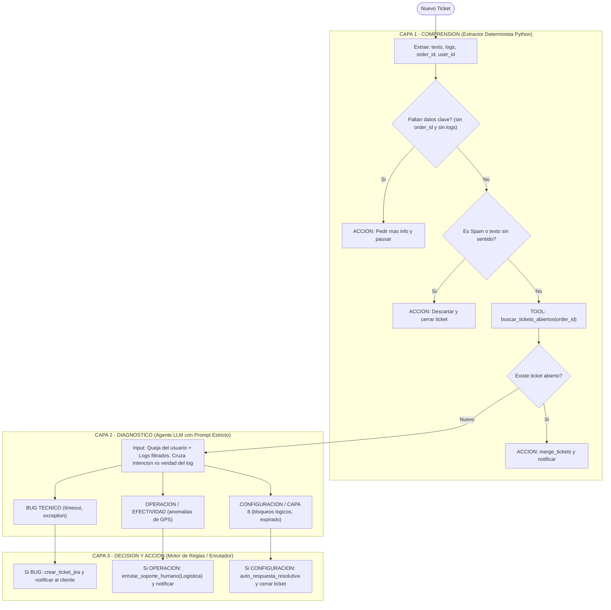

Para abordar este problema optimizando tiempos de respuesta y costos computacionales, la arquitectura se basa en un único Agente Enrutador impulsado por un LLM, apoyado por un pipeline de pre-procesamiento determinista y el uso de herramientas externas.

Se evitó una estructura multi-agente compleja para reducir la latencia y la probabilidad de alucinaciones.

**Diagrama de Flujo de la Arquitectura:**



<details>
<summary>Ver diagrama en texto ASCII (alternativa)</summary>

```text
[Nuevo Ticket]
      │
      ▼
========================= CAPA 1: COMPRENSIÓN =========================
[Extractor Determinista] (Script Python / Reglas)
 ├──> Extrae: texto, logs, order_id, user_id
 │
 ├──> ¿Faltan datos clave (ej. sin order_id y sin logs)?
 │     └──> [ACCIÓN]: Pedir más info al usuario y pausar.
 │
 ├──> ¿Es Spam o texto sin sentido?
 │     └──> [ACCIÓN]: Descartar y cerrar ticket.
 │
 └──> LLAMADA A TOOL: buscar_tickets_abiertos(order_id)
       ├──> Si existe: [ACCIÓN] tool_merge_tickets() y notificar.
       └──> Si es NUEVO: Pasar a Capa 2.

      │
      ▼
========================= CAPA 2: DIAGNÓSTICO =========================
[Agente LLM: Clasificador con Prompt Estricto]
 ├──> Input: {Queja del usuario} + {Logs del sistema filtrados}
 ├──> Lógica: Cruza la intención del usuario vs la verdad del Log.
 │
 ├──> Resultado A: BUG TÉCNICO (ej. timeout, exception)
 ├──> Resultado B: OPERACIÓN / EFECTIVIDAD (ej. anomalías de GPS)
 └──> Resultado C: CONFIGURACIÓN / CAPA 8 (ej. bloqueos lógicos, expirado)

      │
      ▼
======================= CAPA 3: DECISIÓN Y ACCIÓN =======================
[Motor de Reglas / Enrutador]
 ├──> Si [BUG]:
 │     └──> LLAMADA A TOOL: crear_ticket_jira() -> Notificar al cliente.
 │
 ├──> Si [OPERACIÓN]:
 │     └──> LLAMADA A TOOL: enrutar_soporte_humano("Logística") -> Notificar.
 │
 └──> Si [CONFIGURACIÓN]:
       └──> LLAMADA A TOOL: auto_respuesta_resolutiva() -> Cerrar Ticket.
```

</details>

## Descripción de las Capas y Comunicación

El flujo de información se maneja mediante payloads en formato JSON, asegurando que la transición entre el sistema de tickets, el agente de IA y las herramientas externas sea estructurada.

## Capa 1: Comprensión (Filtro Determinista)
Antes de invocar al modelo de lenguaje, un script recibe el payload del ticket. Su objetivo es normalizar los datos, extraer entidades (como el order_id) y ejecutar validaciones básicas.

**Comunicación:** En esta capa, el sistema se comunica mediante API con la base de datos de soporte (usando la herramienta buscar_tickets_abiertos) para evitar el procesamiento de reclamos duplicados. Si la validación falla (falta información o es un ticket repetido), la ejecución termina aquí, ahorrando recursos.

## Capa 2: Diagnóstico (El Cerebro del Agente)
Si el ticket es válido y nuevo, se construye un prompt estructurado inyectando el texto del usuario y el registro exacto del system_logs.

**Comunicación:** Se realiza una llamada a la API del LLM. El agente no actúa de forma conversacional libre; está restringido por instrucciones de sistema para analizar las variables técnicas del log frente a la queja, y su única salida permitida es retornar un JSON con la clasificación exacta (Bug, Operación, Configuración) y una breve justificación de la causa raíz.

## Capa 3: Decisión y Acción (Orquestación)
El sistema lee el JSON estructurado devuelto por la Capa 2 y, basado en la categoría, acciona el árbol de decisiones.

**Comunicación:** En esta etapa se ejecutan las herramientas de escritura. El orquestador hace peticiones POST a las plataformas correspondientes: llama a la API de Jira para crear incidencias, a la API del CRM de soporte para cambiar el estado de un ticket y asignarlo a una cola humana, o al motor de correo/mensajería para enviar una resolución automática al cliente.
